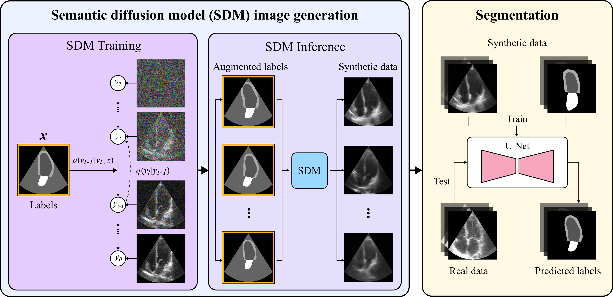
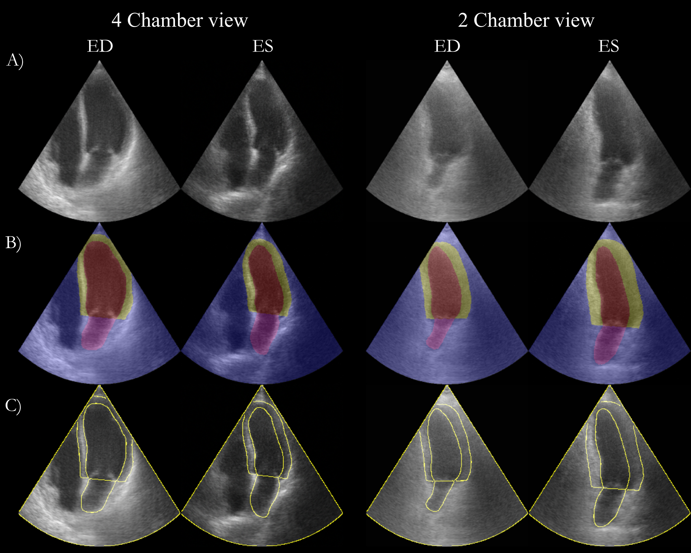
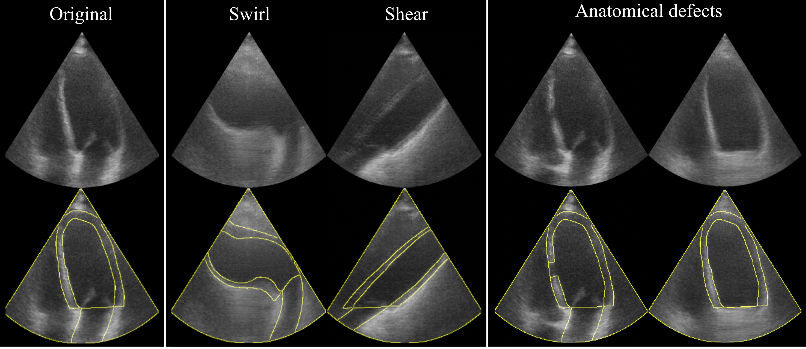

# Echo from noise: synthetic ultrasound image generation using diffusion models for real image segmentation &middot; [](http://makeapullrequest.com) [](https://github.com/your/your-project/blob/master/LICENSE) 

&nbsp;

  

## Update
We have recently released (03/10/2024) a new paper/codebase/dataset which includes a number of extensions and improvements to this work. Find out about it [here](https://github.com/david-stojanovski/EDMLX)

## Cite this work [Springer]

```
@InProceedings{10.1007/978-3-031-44521-7_4,
author="Stojanovski, David
and Hermida, Uxio
and Lamata, Pablo
and Beqiri, Arian
and Gomez, Alberto",
editor="Kainz, Bernhard
and Noble, Alison
and Schnabel, Julia
and Khanal, Bishesh
and M{\"u}ller, Johanna Paula
and Day, Thomas",
title="Echo from Noise: Synthetic Ultrasound Image Generation Using Diffusion Models for Real Image Segmentation",
booktitle="Simplifying Medical Ultrasound",
year="2023",
publisher="Springer Nature Switzerland",
address="Cham",
pages="34--43",
abstract="We propose a novel pipeline for the generation of synthetic ultrasound images via Denoising Diffusion Probabilistic Models (DDPMs) guided by cardiac semantic label maps. We show that these synthetic images can serve as a viable substitute for real data in the training of deep-learning models for ultrasound image analysis tasks such as cardiac segmentation. To demonstrate the effectiveness of this approach, we generated synthetic 2D echocardiograms and trained a neural network for segmenting the left ventricle and left atrium. The performance of the network trained on exclusively synthetic images was evaluated on an unseen dataset of real images and yielded mean Dice scores of {\$}{\$}88.6 {\backslash}pm 4.91{\$}{\$}88.6{\textpm}4.91, {\$}{\$}91.9 {\backslash}pm 4.22{\$}{\$}91.9{\textpm}4.22, {\$}{\$}85.2 {\backslash}pm 4.83{\$}{\$}85.2{\textpm}4.83{\%} for left ventricular endocardium, epicardium and left atrial segmentation respectively. This represents a relative increase of 9.2, 3.3 and 13.9{\%} in Dice scores compared to the previous state-of-the-art. The proposed pipeline has potential for application to a wide range of other tasks across various medical imaging modalities.",
isbn="978-3-031-44521-7"
}
```

## Papers

### [Echo from noise: synthetic ultrasound image generation using diffusion models for real image segmentation Paper](https://link.springer.com/chapter/10.1007/978-3-031-44521-7_4)

[David Stojanovski](https://scholar.google.com/citations?user=6A_chPAAAAAJ&hl=en), [Uxio Hermida](https://scholar.google.com/citations?hl=en&user=6DkZyrXMyKEC), [Pablo Lamata](https://scholar.google.com/citations?hl=en&user=H98n1tsAAAAJ), [Arian Beqiri](https://scholar.google.com/citations?hl=en&user=osD0r24AAAAJ&view_op=list_works&sortby=pubdate), [Alberto Gomez](https://scholar.google.com/citations?hl=en&user=T4fP_swAAAAJ&view_op=list_works&sortby=pubdate)

### [Semantic Diffusion Model Paper](https://arxiv.org/abs/2207.00050)

[Weilun Wang](https://scholar.google.com/citations?hl=zh-CN&user=YfV4aCQAAAAJ), [Jianmin Bao](https://scholar.google.com/citations?hl=zh-CN&user=hjwvkYUAAAAJ), [Wengang Zhou](https://scholar.google.com/citations?hl=zh-CN&user=8s1JF8YAAAAJ), [Dongdong Chen](https://scholar.google.com/citations?hl=zh-CN&user=sYKpKqEAAAAJ), [Dong Chen](https://scholar.google.com/citations?hl=zh-CN&user=_fKSYOwAAAAJ), [Lu Yuan](https://scholar.google.com/citations?hl=zh-CN&user=k9TsUVsAAAAJ), [Houqiang Li](https://scholar.google.com/citations?hl=zh-CN&user=7sFMIKoAAAAJ),

## Abstract

We propose a novel pipeline for the generation of synthetic images via Denoising Diffusion Probabilistic Models (DDPMs)
guided by cardiac ultrasound semantic label maps. We show that these synthetic images can serve as a viable substitute
for real data in the training of deep-learning models for medical image analysis tasks such as image segmentation. To
demonstrate the effectiveness of this approach, we generated synthetic 2D echocardiography images and trained a neural
network for segmentation of the left ventricle and left atrium. The performance of the network trained on exclusively
synthetic images was evaluated on an unseen dataset of real images and yielded mean Dice scores of 88.5 $\pm 6.0$ , 92.3
$\pm 3.9$, 86.3 $\pm 10.7$ \% for left ventricular endocardial, epicardial and left atrial segmentation respectively.
This represents an increase of $9.09$, $3.7$ and $15.0$ \% in Dice scores compared to the previous state-of-the-art. The
proposed pipeline has the potential for application to a wide range of other tasks across various medical imaging
modalities.

## Example Results

&nbsp;

  

&nbsp;

  

&nbsp;

## Prerequisites

- Linux
- Python 3
- CPU or NVIDIA GPU + CUDA CuDNN

## Dataset Preparation

The data used and generated for the paper can be found as follows:

1) The CAMUS data used for training and testing can be
   found [here](https://humanheart-project.creatis.insa-lyon.fr/database/#collection/6373703d73e9f0047faa1bc8/folder/6373727d73e9f0047faa1bca).
2) The generated synthetic data and pretrained models can be
   found [here](https://zenodo.org/record/7921055#.ZFyqd9LMLmE)

- A script to extract the CAMUS data into the required format can be found
  in `./data_preparation/extract_camus_data.py`. All that needs to be edited is the `camus_data_folder`
  and `save_folder_path` variables.


- To then augment the extracted CAMUS data the script `./data_preparation/augment_camus_labels.py` can be used. Again,
  the `data_folder` and `save_folder` variables need to be edited.

- After the network has been trained and inferenced (As explained below) the inferenced images can then be placed in the
  correct folder format for the segmentation task using the `./data_preparation/prepare_inference4segmentation.py`
  script. The `testing_data_folder` is the path to the original CAMUS data and the `sdm_results_folder` is the path to
  the inferenced SDM data. `save_folder` is the path to save the prepared data.

# Semantic Diffusion Model

The default parameters for training and inference can be found in the `./semantic_diffusion_model/config.py` file.
The original network our code is developed on can be
found [here](https://github.com/WeilunWang/semantic-diffusion-model). This also contains a number of scripts with
variations on parameters for both training and inference.

## SDM training

To train the SDM model run:

```bash
mpiexec -np 8 python3 ./image_train.py --datadir ./data/view_folder --savedir ./output --batch_size_train 12 \
 --is_train True --save_interval 50000 --lr_anneal_steps 50000 --random_flip True --deterministic_train False \
 --img_size 256
```

## SDM inference

To inference the SDM model run:

```bash
mpiexec -np 8 python3 ./image_sample.py --datadir ./data/view_folder \
--resume_checkpoint ./path/to/ema_checkpoint.pt --results_dir ./results_2CH_ED --num_samples 2250 \
--is_train False --inference_on_train True
```

# Segmentation Network

## Training Segmentation Network

The main script to run a training of the segmentation network is `./echo_segmentation/runner.py`. An example of how to
run this script is as follows:

```bash
python ./echo_segmentations/runner.py --data-dir /path/to/data/%s/
```

The default parameters of the argparse are those which were used to train the network, and are found
within `./echo_segmentation/runner.py`

## Testing Segmentation Network

The main script to run a training of the segmentation network is `./echo_segmentation/test_model.py`. An example of how
to  run this script is as follows:

```bash
python ./echo_segmentations/test_model.py --data-dir /path/to/data/%s/ --model-path /path/to/model
```

The default parameters of the argparse are those which were used to test the network, and are found
within `./echo_segmentation/test_model.py`
